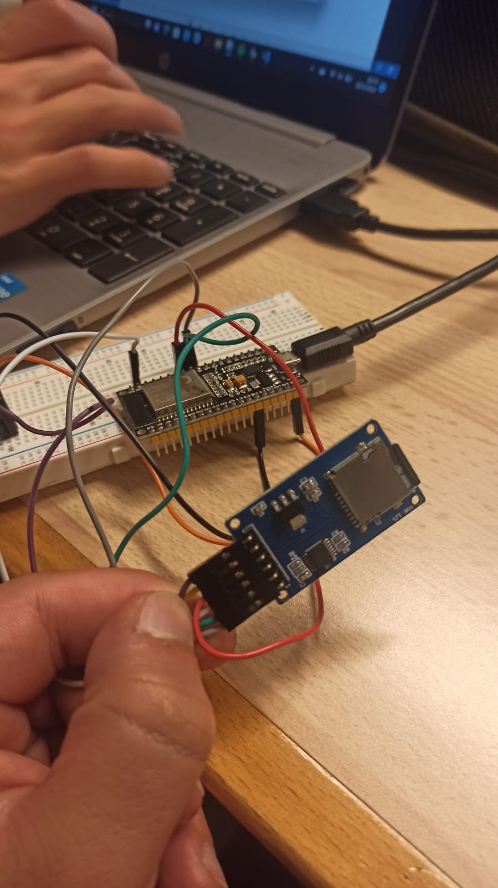

## Practica 6 

En esta practica vamos a utilizar el bus de conexion spi para poder leer archivos a traves de un lector de tarjetas SD

El bus SPI  es un estándar de comunicación síncrona utilizado para la transferencia de datos entre dispositivos electrónicos. Este bus se caracteriza por utilizar una línea de reloj compartida (SCLK) y tres líneas adicionales para la transmisión de datos:
Línea de reloj (SCLK): Esta línea genera pulsos de reloj que sincronizan la transferencia de datos entre los dispositivos conectados.
Línea de datos de entrada (MISO): Esta línea lleva los datos del dispositivo esclavo al dispositivo maestro.
Línea de datos de salida (MOSI): Esta línea lleva los datos del dispositivo maestro al dispositivo esclavo.
Línea de selección de dispositivo (SS o CS): Esta línea se utiliza para seleccionar el dispositivo específico con el que se desea comunicar en un bus SPI de varios dispositivos.

**Codigo**
```cpp
#include <SPI.h>
#include <SD.h>

File myFile;
void setup()
{
Serial.begin(115200);
Serial.print("Iniciando SD ...");
if (!SD.begin(5)) {
Serial.println("No se pudo inicializar");
return;
}
Serial.println("inicializacion exitosa");
myFile = SD.open("archivo.txt");//abrimos el archivo
if (myFile) {
Serial.println("archivo.txt:");
while (myFile.available()) {
Serial.write(myFile.read());
}
myFile.close(); //cerramos el archivo
} else {
Serial.println("Error al abrir el archivo");
}
}
void loop()
{
}
```

**Librerias**

```cpp
#include <SPI.h>
#include <SD.h>
```
En este caso solamente añadimos 2 libreiras la que nos permite utilizar el bus SPI y la que nos permite inicializar el lector de sd y gestionar archivos
**Declaraciones**
```cpp
File myfile;
```
En este caso solo declararemos un objeto file para poder abrirlo mas tarde desde la sd
**SETUP**
```cpp
void setup()
{
Serial.begin(115200);
Serial.print("Iniciando SD ...");
if (!SD.begin(5)) {
Serial.println("No se pudo inicializar");
return;
}
Serial.println("inicializacion exitosa");
myFile = SD.open("archivo.txt");//abrimos el archivo
if (myFile) {
Serial.println("archivo.txt:");
while (myFile.available()) {
Serial.write(myFile.read());
}
myFile.close(); //cerramos el archivo
} else {
Serial.println("Error al abrir el archivo");
}
}
```
En este programa  no dispondremos de main loop ya que todo el progrma se ejecutara 1 vez en el void setup.

Comenzamos inicializando el Serial para ver si todo funciona correctamente, tambien inicializaremos el lector de sd que estara conectado a la ESp a traves del bus SPI si este no se puede iniciar se mostrara por pantalla un error.
Si todo funciona correctamente procederemos a abrir un archivo de texto desde la memoria externa y mostraremos el contenido que hay por pantalla.
Si esto no funciona nos dara error
NOTA: En este paso se ha de tener en cuenta que la memoria externa (SD) puede dar diversos problemas para evitar la mayoria de estos se recomienda formatear la tarjeta antes de utilizarla en formato FAT o FAT32 para que la lectura se pueda realizar correctamente.


